# Mermaid Class Diagram Examples

## Class diagram overview

> "In software engineering, a class diagram in the Unified Modeling Language (UML) is a type of static structure diagram that describes the structure of a system by showing the system's classes, their attributes, operations (or methods), and the relationships among objects." -- Wikipedia

The class diagram is the main building block of object-oriented modeling. It is used for general conceptual modeling of the structure of the application, and for detailed modeling to translate the models into programming code. Class diagrams can also be used for data modeling. The classes in a class diagram represent both the main elements, interactions in the application, and the classes to be programmed.

Example:

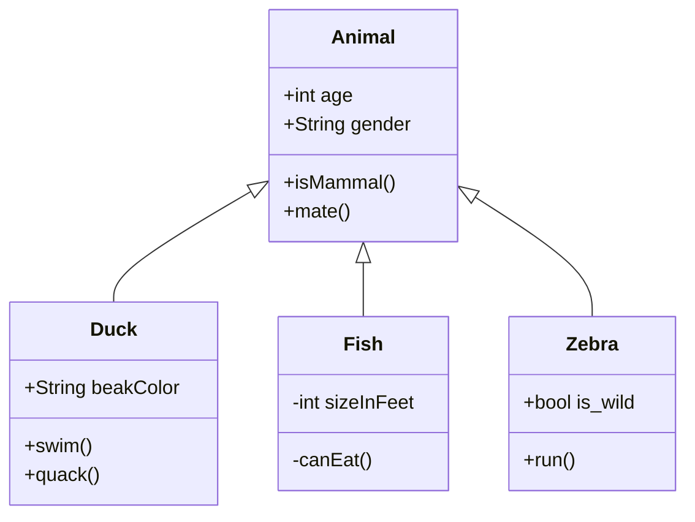

-----

## Syntax

UML provides mechanisms to represent class members, such as attributes and methods, and additional information about them. A single instance of a class in the diagram contains three compartments:

1. The top compartment contains the name of the class. It is printed in bold and centered, and the first letter is capitalized. It may also contain optional annotation text describing the nature of the class.

2. The middle compartment contains the attributes of the class. They are left-aligned and the first letter is lowercase.

3. The bottom compartment contains the operations the class can execute. They are also left-aligned and the first letter is lowercase.

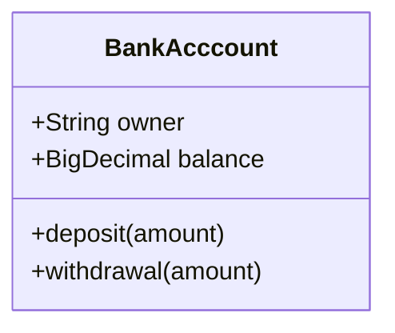

-----

## Define a class

UML provides mechanisms to represent class members such as attributes and methods, as well as additional information about them.

Mermaid distinguishes between attributes and functions/methods based on if the **parenthesis**  ```()``` are present or not. The ones with () are treated as functions/methods, and all others as attributes.

There are two ways to define the members of a class, and regardless of whichever syntax is used to define the members, the output will still be same. The two different ways are:

1. Associate a member of a class using : (colon) followed by member name, useful to define one member at a time. For example:


2. Associate members of a class using {} brackets, where members are grouped within curly brackets. Suitable for defining multiple members at once. For example:

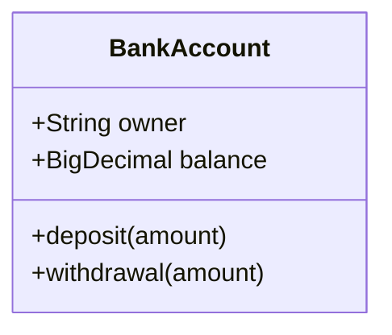

### Return type

Optionally you can end a method/function definition with the data type that will be returned (note: there must be a space between the final ```)``` and the return type. An example:

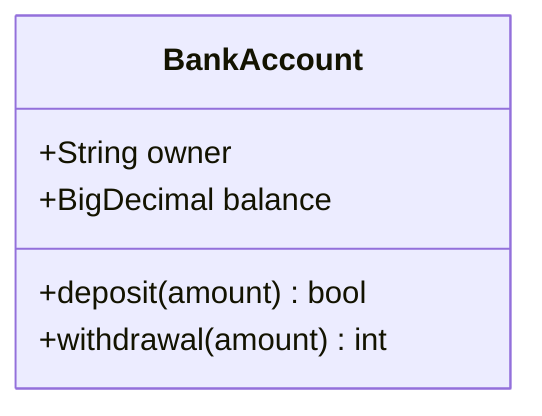

### Generic types

Members can be defined using generic types, such as ```List<int>```, for fields, parameters, and return types by enclosing the type within ```~``` **(tilde)**. Note: **nested** type declarations such as ```List<List<int>>``` are not currently supported.

Generics can be represented as part of a class definition and also in the parameters or the return value of a method/function:

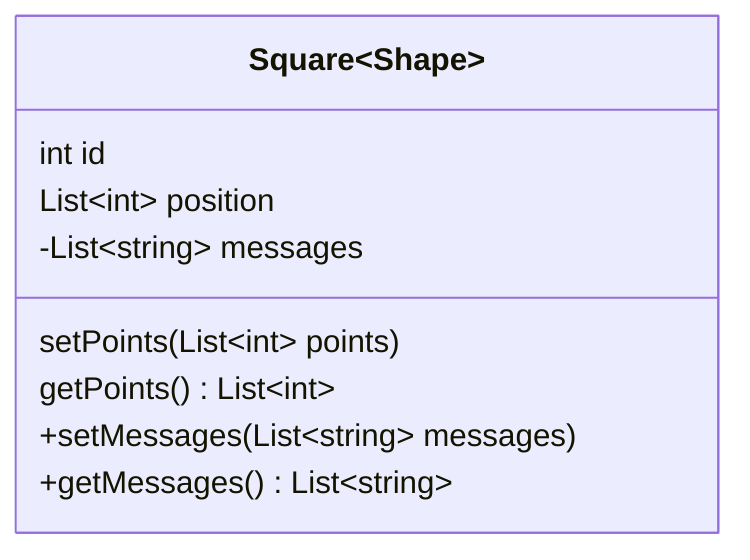

### Visibility

To describe the visibility (or encapsulation) of an attribute or method/function that is a part of a class (i.e. a class member), optional notation may be placed before that members' name:

- ```+``` Public
- ```-``` Private
- ```#``` Protected
- ```~``` Package/Internal

***Note.*** You can  include additional ***classifiers*** to a method definition by adding the following notation to the ***end*** of the method, i.e., after the ```()```:

- ```*``` Abstract e.g.: ```someAbstractMethod()*```
- ```$``` Static e.g.: ```someStaticMethod()$```

***Note.*** You can include additoinal ***classifiers*** to a feild definition by adding the following notation to the end of its name:

- ```$``` Static e.g.: ```String someField$```

-----

## Defining relationship

A relationship is a general term covering the specific types of logical connections found on class and object diagrams.

```[classA][Arrow][ClassB]:LabelText```

There are eight different types of relations defined for classes under UML which are currently supported:

| Type  | Description         |
| ----- | ------------------- |
| <\|-- | Inheritance         |
| \*--   | Composition         |
| o--   | Aggregation         |
| -->   | Association         |
| --    | Link (solid)        |
| ..>   | Dependency          |
| ..\|> | Realization         |
| ..    | Link (dashed)       |

Examples:

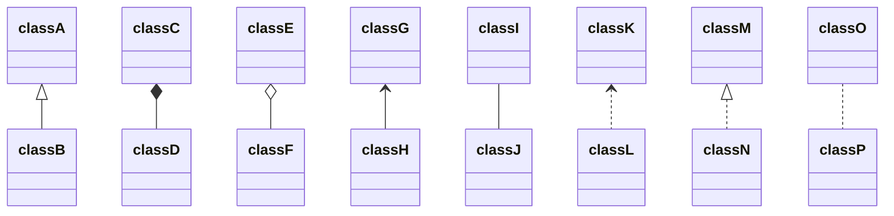

We can use the labels to describe the nature of the relation between two classes. Also, arrowheads can be used in the opposite direction as well:

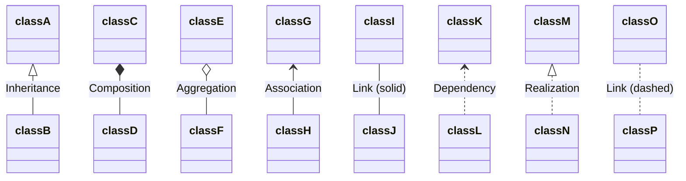

Relations can logically represent an N:M association:

Where ```Relation Type``` can be one of:

| Type  | Description         |
| ----- | ------------------- |
| <\|   | Inheritance         |
| *     | Composition         |
| o     | Aggregation         |
| >     | Association         |
| <     | Association         |
| \|>   | Realization         |

And ```Link``` can be one of:

| Type  | Description         |
| ----- | ------------------- |
| --    | Solid               |
| ..    | Dashed              |

-----

## Cardinality / Multiplicity on relations

Multiplicity or cardinality in class diagrams indicates the number of instances of one class that can be linked to an instance of the other class. For example, each company will have one or more employees (not zero), and each employee currently works for zero or one companies.

Multiplicity notations are placed near the end of an association.

The different cardinality options are:

- ```1``` Only 1
- ```0..1``` Zero or one
- ```1..*``` One or more
- ```*``` Many
- ```n``` n (where n > 1)
- ```0..n``` Zero to n (where n > 1)
- ```1..n``` One to n (where n > 1)

Cardinality can be easily defined by placing the text option within quotes ```"```.

```[classA] "cardinality1" [Arrow] "cardinality2" [ClassB]:LabelText```

Example:

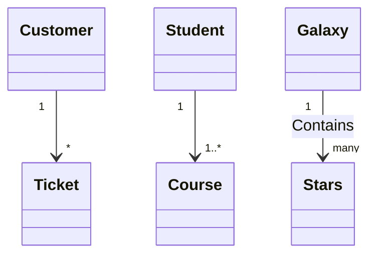

-----

## Annotations on classes

It is possible to annotate classes with markers to provide additional metadata about the class. This can give a clearer indication about its nature. Some common annotations include:

- ```<<Interface>>``` Represents an interface class
- ```<<Abstract>>``` Represents an abstract class
- ```<<Service>>``` Represents a service class
- ```<<Enumeration>>``` Represents an enum

Annotations are defined within the opening ```<<``` and closing ```>>```. There are two ways to add an annotation to a class, and either way the output will be same:

- In a *separate line* after a class is defined:

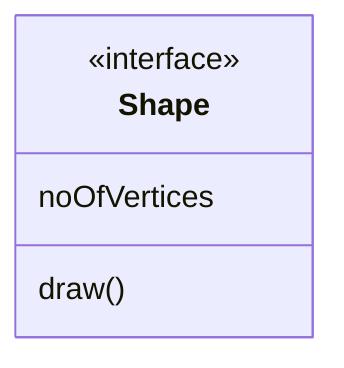

- In a *nested structure* along with the class definition:

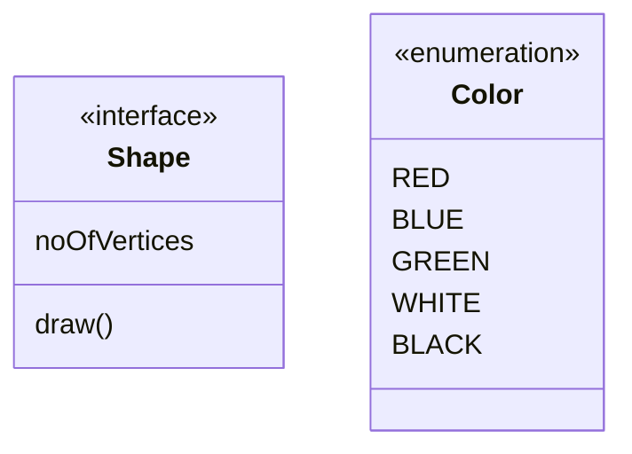

-----

## Comments

Comments can be entered within a class diagram, which will be ignored by the parser. Comments need to be on their own line, and must be prefaced with ```%%``` (double percent signs). Any text until the next newline will be treated as a comment, including any class diagram syntax.


-----

## Setting the direction of the diagram

With class diagrams you can use the direction statement to set the direction in which the diagram will render:

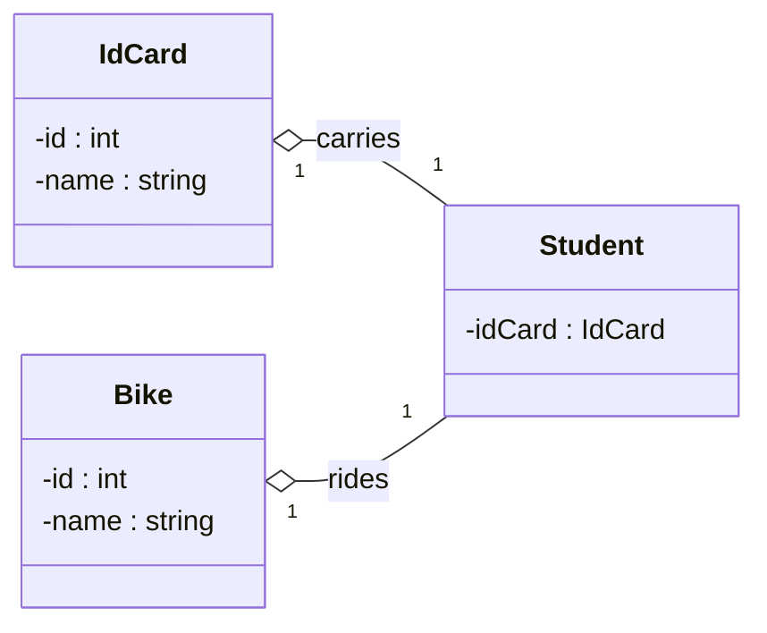

-----

## Interaction

It is possible to bind a click event to a node. The click can lead to either a javascript callback or to a link which will be opened in a new browser tab. **Note:** This functionality is disabled when using ```securityLevel='strict'``` and enabled when using ```securityLevel='loose'```.

You would define these actions on a separate line after all classes have been declared.

```markdown
action className "reference" "tooltip"
click className call callback() "tooltip"
click className href "url" "tooltip"
```

- *action* is either ```link``` or ```callback```, depending on which type of interaction you want to have called
- *className* is the id of the node that the action will be associated with
- *reference* is either the url link, or the function name for callback.
- *(optional) tooltip* is a string to be displayed when hovering over element (Note: The styles of the tooltip are set by the class .mermaidTooltip.)
- **Note:** Callback function will be called with the nodeId as parameter.

### Examples

*URL Link:*

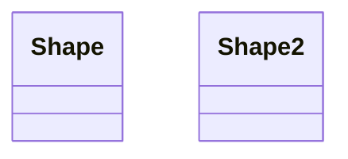

*Callback:*


```javascript
    <script>
      var callbackFunction = function() {
        alert('A callback was triggered');
      }
    </script>
```

-----
