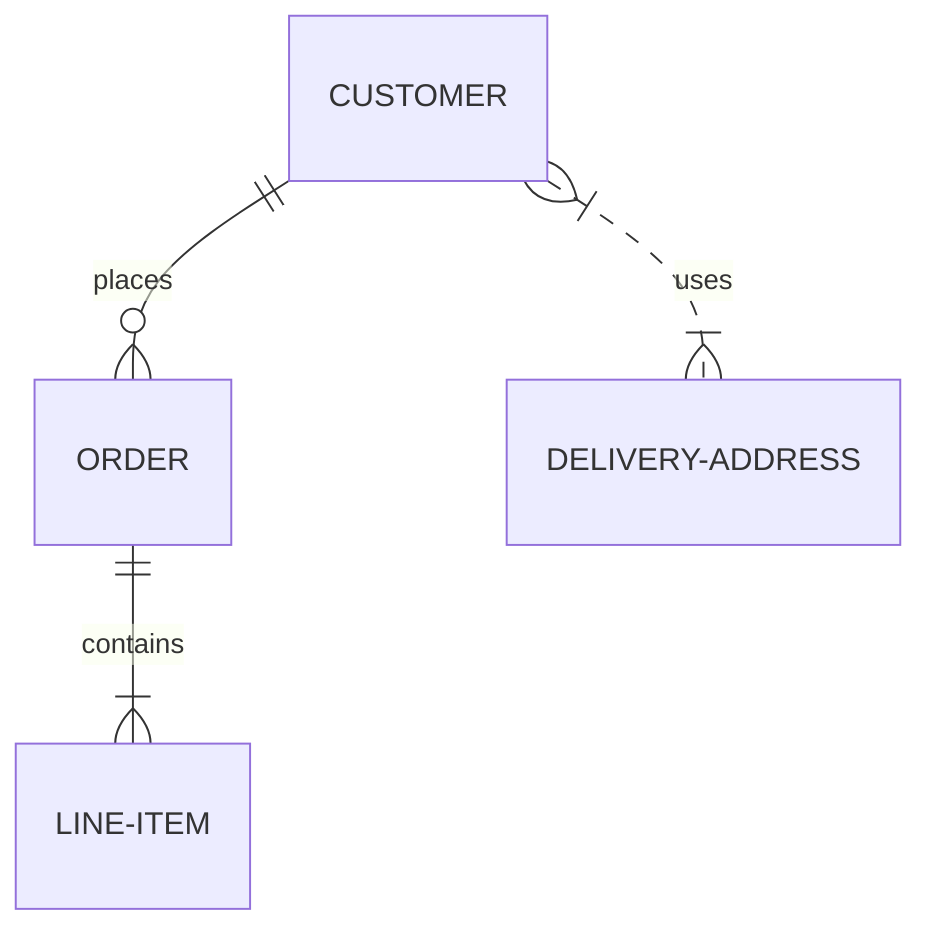
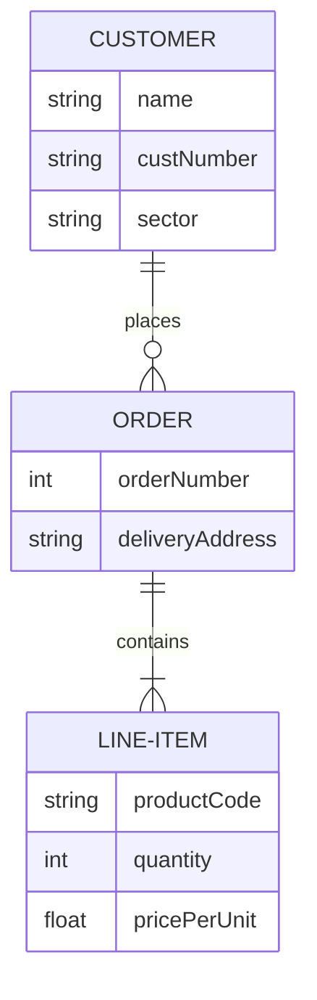

# Mermaid Entity-Relationship Diagram Examples

## Entity-relationship diagram overview

> An entity–relationship model (or ER model) describes interrelated things of interest in a specific domain of knowledge. A basic ER model is composed of entity types (which classify the things of interest) and specifies relationships that can exist between entities (instances of those entity types). - Wikipedia

Note that practitioners of ER modeling almost always refer to *entity types* simply as *entities*. For example the `CUSTOMER` entity type would be referred to simply as the `CUSTOMER` entity. This is so common it would be inadvisable to do anything else, but technically an entity is an abstract instance of an entity type, and this is what an ER diagram shows - abstract instances, and the relationships between them. This is why entities are always named using singular nouns.

Example: ER diagram:

Entity names are often capitalized, although there is no accepted standard on this, and it is not required in Mermaid.

Relationships between entities are represented by lines with end markers representing cardinality. Mermaid uses the most popular crow's foot notation. The crow's foot intuitively conveys the possibility of many instances of the entity that it connects to.

ER diagrams can be used for various purposes, ranging from abstract logical models devoid of any implementation details, through to physical models of relational database tables. It can be useful to include attribute definitions on ER diagrams to aid comprehension of the purpose and meaning of entities. These do not necessarily need to be exhaustive; often a small subset of attributes is enough. Mermaid allows them to be defined in terms of their *type* and *name*.

**A Note on Foreign Key attributes.** When including attributes on ER diagrams, you must decide whether to include foreign keys as attributes. This probably depends on how closely you are trying to represent relational table structures. If your diagram is a logical model which is not meant to imply a relational implementation, then it is better to leave these out because the associative relationships already convey the way that entities are associated. For example, a JSON data structure can implement a one-to-many relationship without the need for foreign key properties, using arrays. Similarly an object-oriented programming language may use pointers or references to collections. Even for models that are intended for relational implementation, you might decide that inclusion of foreign key attributes duplicates information already portrayed by the relationships, and does not add meaning to entities. Ultimately, it's your choice.

-----

## Syntax
