# Mermaid Flowchart Example

## A node (default)
```mermaid
flowchart LR
  id
````

<hr>

## A node with text

```mermaid
  flowchart LR
    id1[This is the text in the node]
```

<hr>

## Declaring the direction of the flowchart
- TD = top-down (default)
- LR = left-right
- TB = top-bottom
- BT = bottom-top
- RL = right-left

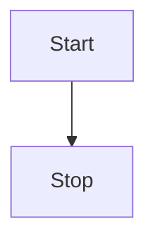

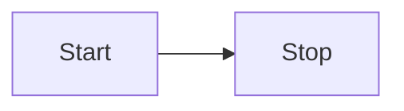

<hr>

## Node shapes
### Round edges

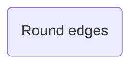

### Stadium shaped

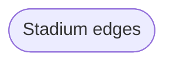

### Subroutine shaped

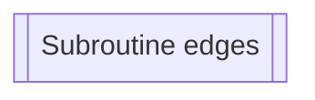

### Database shaped

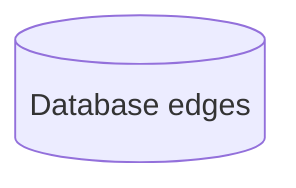

### Subroutine shaped


### Circle shaped

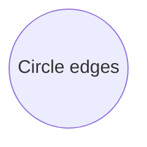

### Asymmetric shaped

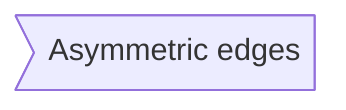

### Hexagon shaped

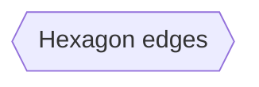

### Rhombus shaped

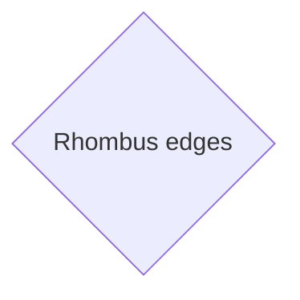

### Parallelogram shaped

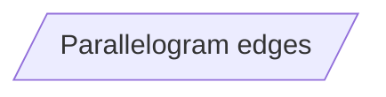

### Parallelogram Alt shaped

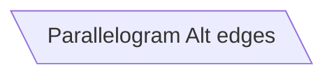

### Trapezoid shaped

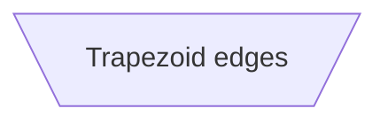

### Trapezoid Alt shaped

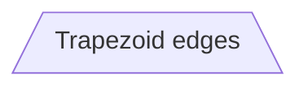

### Double Circle shaped

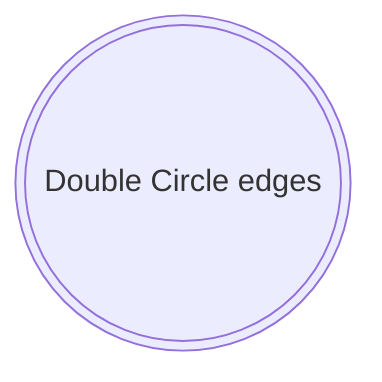

<hr>

## Links between nodes

### A link with an arrow head

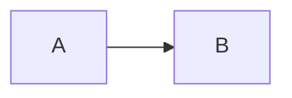

### An open link

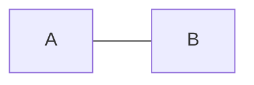

### Text in links

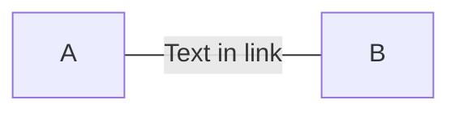

or...

```mermaid
  flowchart LR
    A ---| Text in link| B
```

### A link with arrowhead and text

```mermaid
  flowchart LR
    A -->|text| B
```

or...

```mermaid
  flowchart LR
    A -- text --> B 
```

### Dotted link

```mermaid
  flowchart LR
    A -.-> B
```

### Dotted link with text

```mermaid
  flowchart LR
    A -. text in link .-> B
```

### Thick link

```mermaid
  flowchart LR
    A ==> B 
```

### Thick link with text

```mermaid
  flowchart LR
    A == text ==> B
```

### Chaining links

```mermaid
  flowchart LR
    A -- text --> B -- text2 --> C
```

```mermaid
  flowchart LR
    A --> B & C
```

```mermaid
  flowchart LR
    A --> B & C --> D
```

```mermaid
  flowchart TB
    A & B --> C
```

```mermaid
  flowchart TB
    A & B --> C & D
```

or...

```mermaid
  flowchart TB
    A --> C
    A --> D
    B --> C
    B --> D
```

### Multi-directional arrows and different line caps

```mermaid
  flowchart LR
    A o--o B
    B <--> C
    C x--x D
```

### Minimum length of a link

Each node in the flowchart is ultimately assigned to a rank in the rendered graph, i.e. to a vertical or horizontal level (depending on the flowchart orientation), based on the nodes to which it is linked. By default, links can span any number of ranks, but you can ask for any link to be longer than the others by adding extra dashes in the link definition.

In the following example, two extra dashes are added in the link from node B to node E, so that it spans two more ranks than regular links:

```mermaid
  flowchart TD
    A[Start] --> B{Is it?}
    B --> |Yes| C[Ok]
    C --> D[Rethink]
    D --> B
    B ---->|No| E[End]
```

<hr>

## Special characters that break syntax

It is possible to put text within quotes in order to render more troublesome characters. As in the example below:

```mermaid
  flowchart LR
    id1["This is the (text) in the box"]
```

It is also possible to escape characters using the syntax exemplified here:

```mermaid
  flowchart LR
    A["A double quote:#quot;"] --> B["A dec char:#9829;"]
```

Numbers given are base 10, so **#** can be encoded as **#35;**.

Mermaid also supports use of HTML character names.

<hr>

## Subgraphs

Subgraphs follow the pattern below:

```
subgraph title
  graph definition
end
```

Example:


```mermaid
  flowchart TB
    c1 --> a2
    
    subgraph one
    a1 --> a2
    end
    
    subgraph two
    b1 --> b2
    end
    
    subgraph three
    c1 --> c2
    end
```

You can also set an explicit id for the subgraph. Example:

```mermaid
  flowchart TB
    c1 --> a2
    
    subgraph ide1 [one]
    a1 --> a2
    end
```

With the graphtype flowchart it is also possible to set edges to and from subgraphs as in the flowchart below:

```mermaid
  flowchart TB
    c1 --> a2
    
    subgraph one
    a1 --> a2
    end
    
    subgraph two
    b1 --> b2
    end

    subgraph three
    c1 --> c2
    end

    one --> two
    three --> two
    two --> c2
```

With the graphtype flowcharts you can use the direction statement to set the direction which the subgraph will render like in this example:

```mermaid
  flowchart LR
  
  subgraph TOP
    direction TB
    
    subgraph B1
        direction RL
        i1 --> f1
    end
    
    subgraph B2
        direction BT
        i2 --> f2
    end
  end
  
  A --> TOP --> B
  B1 --> B2
```

<hr>

## Interaction
