# Mermaid Flowchart Examples

## A node (default)
```mermaid
flowchart LR
  id
````

<hr>

## A node with text

```mermaid
  flowchart LR
    id1[This is the text in the node]
```

<hr>

## Declaring the direction of the flowchart
- TD = top-down (default)
- LR = left-right
- TB = top-bottom
- BT = bottom-top
- RL = right-left

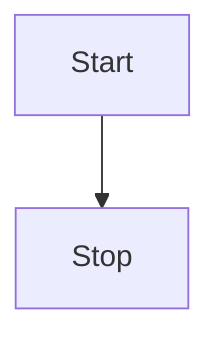

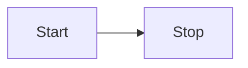

<hr>

## Node shapes
### Round edges

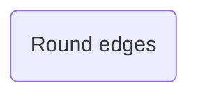

### Stadium shaped


### Subroutine shaped

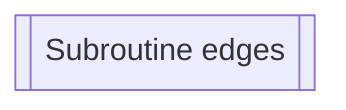

### Database shaped

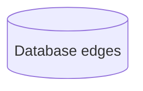

### Subroutine shaped


### Circle shaped

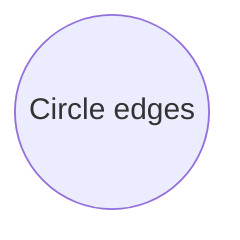

### Asymmetric shaped

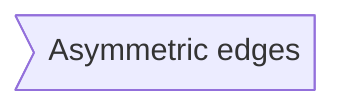

### Hexagon shaped

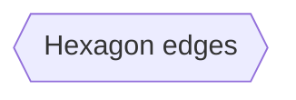

### Rhombus shaped

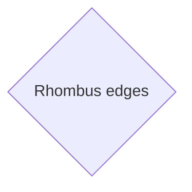

### Parallelogram shaped

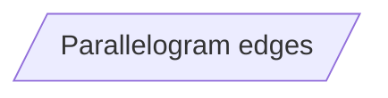

### Parallelogram Alt shaped

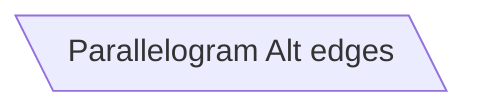

### Trapezoid shaped

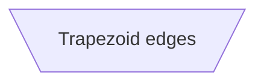

### Trapezoid Alt shaped

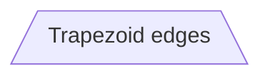

### Double Circle shaped

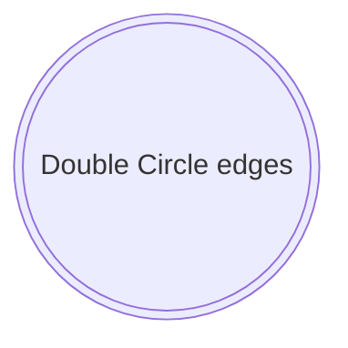

<hr>

## Links between nodes

### A link with an arrow head

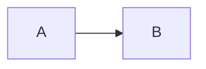

### An open link

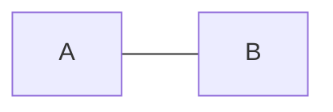

### Text in links

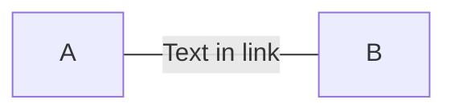

or...

```mermaid
  flowchart LR
    A ---| Text in link| B
```

### A link with arrowhead and text

```mermaid
  flowchart LR
    A -->|text| B
```

or...

```mermaid
  flowchart LR
    A -- text --> B 
```

### Dotted link

```mermaid
  flowchart LR
    A -.-> B
```

### Dotted link with text

```mermaid
  flowchart LR
    A -. text in link .-> B
```

### Thick link

```mermaid
  flowchart LR
    A ==> B 
```

### Thick link with text

```mermaid
  flowchart LR
    A == text ==> B
```

### Chaining links

```mermaid
  flowchart LR
    A -- text --> B -- text2 --> C
```

```mermaid
  flowchart LR
    A --> B & C
```

```mermaid
  flowchart LR
    A --> B & C --> D
```

```mermaid
  flowchart TB
    A & B --> C
```

```mermaid
  flowchart TB
    A & B --> C & D
```

or...

```mermaid
  flowchart TB
    A --> C
    A --> D
    B --> C
    B --> D
```

### Multi-directional arrows and different line caps

```mermaid
  flowchart LR
    A o--o B
    B <--> C
    C x--x D
```

### Minimum length of a link

Each node in the flowchart is ultimately assigned to a rank in the rendered graph, i.e. to a vertical or horizontal level (depending on the flowchart orientation), based on the nodes to which it is linked. By default, links can span any number of ranks, but you can ask for any link to be longer than the others by adding extra dashes in the link definition.

In the following example, two extra dashes are added in the link from node B to node E, so that it spans two more ranks than regular links:

```mermaid
  flowchart TD
    A[Start] --> B{Is it?}
    B --> |Yes| C[Ok]
    C --> D[Rethink]
    D --> B
    B ---->|No| E[End]
```

<hr>

## Special characters that break syntax

It is possible to put text within quotes in order to render more troublesome characters. As in the example below:

```mermaid
  flowchart LR
    id1["This is the (text) in the box"]
```

It is also possible to escape characters using the syntax exemplified here:

```mermaid
  flowchart LR
    A["A double quote:#quot;"] --> B["A dec char:#9829;"]
```

Numbers given are base 10, so **#** can be encoded as **#35;**.

Mermaid also supports use of HTML character names.

<hr>

## Subgraphs

Subgraphs follow the pattern below:

```
subgraph title
  graph definition
end
```

Example:


```mermaid
  flowchart TB
    c1 --> a2
    
    subgraph one
    a1 --> a2
    end
    
    subgraph two
    b1 --> b2
    end
    
    subgraph three
    c1 --> c2
    end
```

You can also set an explicit id for the subgraph. Example:

```mermaid
  flowchart TB
    c1 --> a2
    
    subgraph ide1 [one]
    a1 --> a2
    end
```

With the graphtype flowchart it is also possible to set edges to and from subgraphs as in the flowchart below:

```mermaid
  flowchart TB
    c1 --> a2
    
    subgraph one
    a1 --> a2
    end
    
    subgraph two
    b1 --> b2
    end

    subgraph three
    c1 --> c2
    end

    one --> two
    three --> two
    two --> c2
```

With the graphtype flowcharts you can use the direction statement to set the direction which the subgraph will render like in this example:

```mermaid
  flowchart LR
  
  subgraph TOP
    direction TB
    
    subgraph B1
        direction RL
        i1 --> f1
    end
    
    subgraph B2
        direction BT
        i2 --> f2
    end
  end
  
  A --> TOP --> B
  B1 --> B2
```

<hr>

## Interaction

It is possible to bind a click event to a node, the click can lead to either a javascript callback or to a link which will be opened in a new browser tab.

**Note:** This functionality is disabled when using `securityLevel='strict'` and enabled when using `securityLevel='loose'`

**Warning:** Tooltips do not work in many markdown editors. However they do work more frequently when when Mermaid is rendered interactively in web pages.

> `click nodeId callback`
> `click nodeId call callback()`

- *nodeId* is the id of the node
- *callback* is the name of a javascript function defined on the page displaying the graph, the function will be called with the nodeId as parameter

Example of tooltip usage:

```
<script>
  var callback = function () {
    alert('A callback was triggereed');
  };
</script>
```

The tooltip text is surrounded in double quotes. The styles of the tooltip are set by the class `.mermaidTooltip`

```mermaid
  flowchart LR
    A --> B
    B --> C
    C --> D
    click A callback "Tooltip for a callback"
    click B "https://www.github.com" "Tooltip for a link"
    click A call callback() "Tooltip for a callback"
    click B href "https://www.github.com" "Tooltip for a link"
```

A working example can be demoed using the following page: [Flowchart-Interactive.html](Flowchart-Interactive.html)

```
<html>
   <body>
        <script src="https://cdn.jsdelivr.net/npm/mermaid/dist/mermaid.min.js"></script>
        <script>
            mermaid.initialize({ startOnLoad: true });
        </script>
        
        <script>
        var callback = function () {
            alert('A callback was triggered');
        };
        var config = {
            startOnLoad: true,
            flowchart: { useMaxWidth: true, htmlLabels: true, curve: 'cardinal' },
            securityLevel:'loose'
        };
        mermaid.initialize(config);
        </script>
        
        <div class="mermaid">
        flowchart LR
            A-->B
            B-->C
            C-->D
            click A callback "Tooltip"
            click B "https://www.github.com" "This is a link"
            click C call callback() "Tooltip"
            click D href "https://www.github.com" "This is a link"
        </div>
    </body>
</html>
```

<hr>

## Comments

Comments can be entered within a flow diagram, which will be ignored by the parser.
- Comments need to be on their own line, and must be prefaced with `%%`(double percent signs)
- Any text after the start of the comment to the next newline will be treated as a comment, including any flow syntax

```
  mermaid
    flowchart LR
    %% this is a commnet A -- text --> B{node}
    A -- text --> B -- text 2 --> C
```

Results in...

```mermaid
  flowchart LR
    %% this is a commnet A -- text --> B{node}
    A -- text --> B -- text 2 --> C
```

<hr>

## Styling and classes

### Styling links

**Warning** As of Sept 2022, link coloring did not seem to be working correctly

It is possible to style links. For instance, you might want to style a link that is going backwards in the flow. As links have no ids in the same way as nodes, some other way of deciding what style the links should be attached to is required. Instead of ids, the order number of when the link was defined in the graph is used, or use default to apply to all links.

In the example below the style defined in the linkStyle statement will belong to the fourth link (zero-based) in the graph:

```mermaid
  flowchart LR
    A --> B --> C --> D --> E
    linkStyle 3 stroke:#ff3,stroke-width:4px,color:red;
```

### Styling a node

It is possible to apply specific styles such as a thicker border or a different background color to a node


```mermaid
  flowchart LR
    id1(Start) --> id2(Stop)
    style id1 fill:#f9f,stroke:#333,stroke-width:4px
    style id2 fill:#bbf,stroke:#f66,stroke-width:2px,color:#fff,stroke-dasharray: 5 5
```

<hr>

## Support for fontawesome

It is possible to add icons from fontawesome.

The icons are accessed via the syntax fa:#icon class name.

**Warning:** Not compatible with all markdown viewers

```mermaid
  flowchart TD
    B["fa:fa-twitter for peace"]
    B --> C[fa:fa-ban forbidden]
    B --> D(fa:fa-spinner)
    B --> E(A fa:fa-camera-retro perhaps?)
```

<hr>

## Configuration

Is it possible to adjust the width of the rendered flowchart.

This is done by defining **mermaid.flowchartConfig** or by the CLI to use a JSON file with the configuration. How to use the CLI is described in the mermaidCLI page. mermaid.flowchartConfig can be set to a JSON string with config parameters or the corresponding object.

```
  mermaid.flowchartConfig = {
    width: 100%
  }
```
