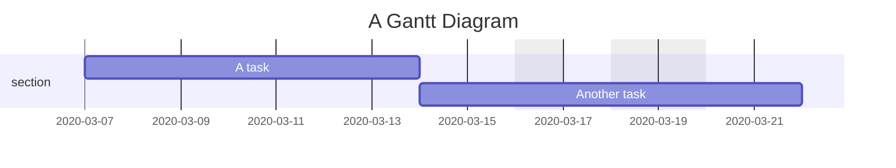
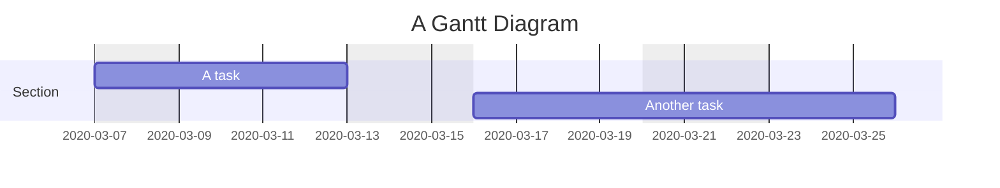
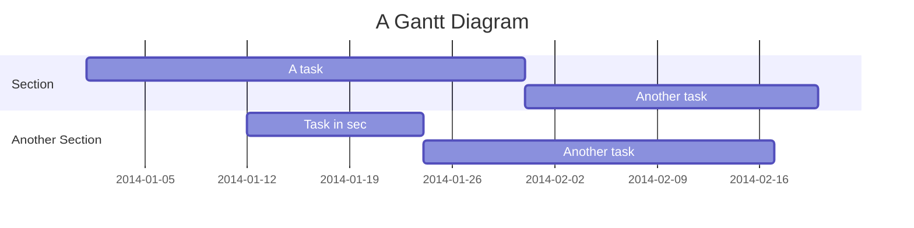

# Mermaid JS Gantt Chart Diagram Documentation

## Gantt chart overview

> A Gantt chart is a type of bar chart, first developed by Karol Adamiecki in 1896, and independently by Henry Gantt in the 1910s, that illustrates a project schedule and the amount of time it would take for any one project to finish. Gantt charts illustrate number of days between the start and finish dates of the terminal elements and summary elements of a project.

Gantt Charts will record each scheduled task as one continuous bar that extends from the left to the right. The x axis represents time and the y records the different tasks and the order in which they are to be completed.

It is important to remember that when a date, day, or collection of dates specific to a task are "excluded", the Gantt Chart will accommodate those changes by extending an equal number of days, towards the right, not by creating a gap inside the task. As shown here:

However, if the excluded dates are between two tasks that are set to start consecutively, the excluded dates will be skipped graphically and left blank, and the following task will begin after the end of the excluded dates. As shown here:

A Gantt chart is useful for tracking the amount of time it would take before a project is finished, but it can also be used to graphically represent "non-working days", with a few tweaks.

Mermaid can render Gantt diagrams as SVG, PNG or a MarkDown link that can be pasted into docs.

-----
