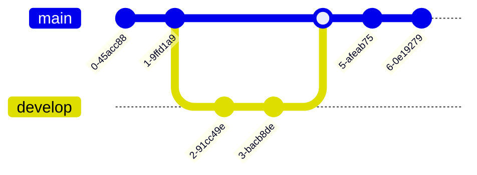

# Mermaid JS Git Graph Diagram Documentation

## Git graph overview

> A Git Graph is a pictorial representation of git commits and git actions(commands) on various branches.

These kind of diagram are particularly helpful to developers and devops teams to share their Git branching strategies. For example, it makes it easier to visualize how git flow works.

Mermaid can render Git diagrams. Example:

Mermaid  supports the basic git operations like:

- **commit** : Representing a new commit on the current branch.
- **branch** : To create & switch to a new branch, setting it as the current branch.
- checkout : To checking out an existing branch and setting it as the current branch. : To checking out an existing branch and setting it as the current branch.
- **merge** : To merge an existing branch onto the current branch.

With the help of these key git commands, you will be able to draw a gitgraph in Mermaid very easily and quickly. Entity names are often capitalized, although there is no accepted standard on this, and it is not required in Mermaid.

-----

## Syntax