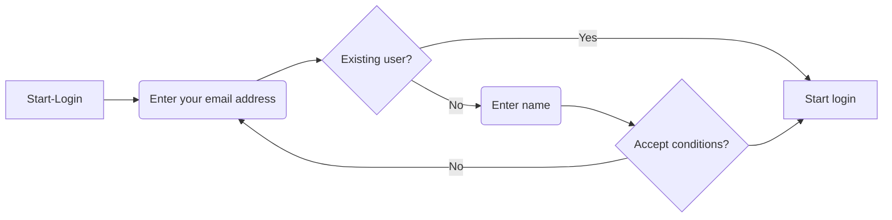
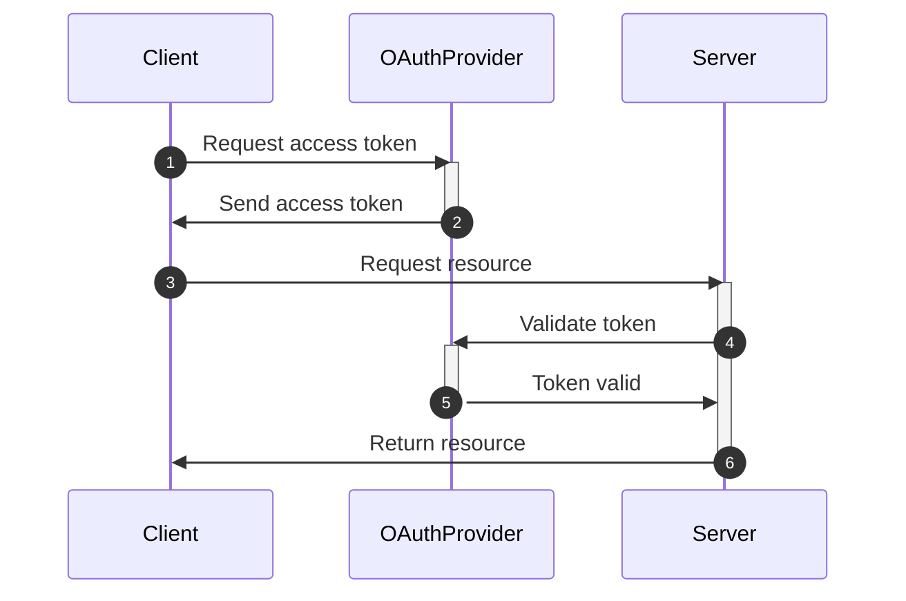

<!---
Exercises for YouTube introductory video: "Mermaid JS: Finally There's A Great UML & Diagram Drawing Tool"; https://youtu.be/JiQmpA474BY
-->

# Mermaid tutorial

Let's go!

```mermaid
flowchart LR
    Start-Login --> A(Enter your email address);
    A --> B{Existing user?};
    B --> |Yes| C[Start login];
    B --> |No| D(Enter name);
    D --> E{Accept conditions?};
    E --> C;
    E --> |No| A;
```

```mermaid
sequenceDiagram
   participant Client;
   participant OAuthProvider;
   participant Server;

   autonumber;

   Client ->> OAuthProvider: Request access token;
   activate OAuthProvider;
   OAuthProvider ->> Client: Send access token;
   deactivate OAuthProvider;
   Client ->> Server: Request resource;
   activate Server;
   Server ->> OAuthProvider: Validate token;
   activate OAuthProvider;
   OAuthProvider ->> Server: Token valid
   deactivate OAuthProvider;
   Server ->> Client: Return resource;
   deactivate Server;
```