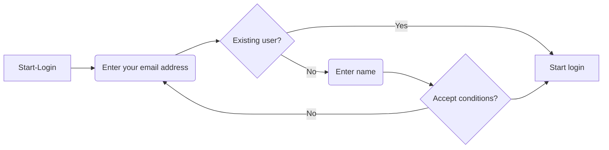

# Mermaid tutorial

Let's go!

```mermaid
flowchart LR
    Start-Login --> A(Enter your email address);
    A --> B{Existing user?};
    B --> |Yes| C[Start login]
    B --> |No| D(Enter name)
    D --> E{Accept conditions?}
    E --> C
    E --> |No| A
```
