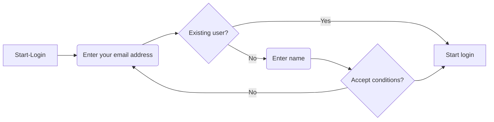
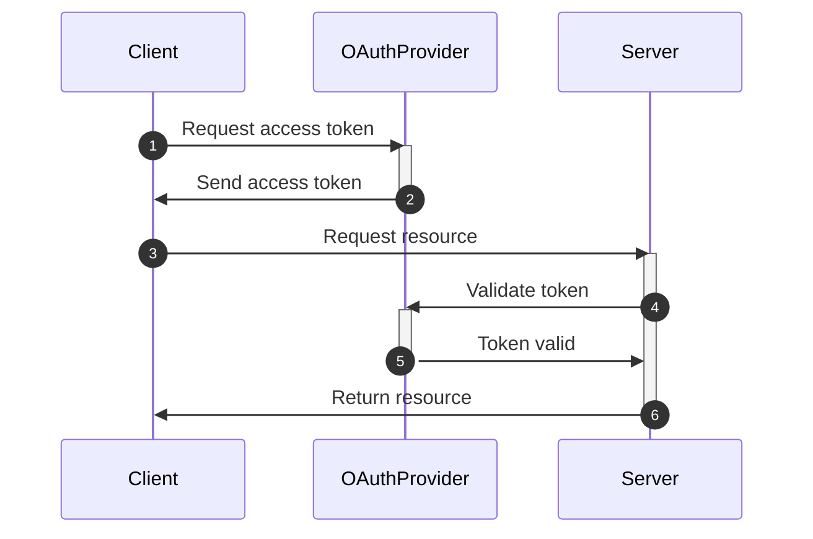
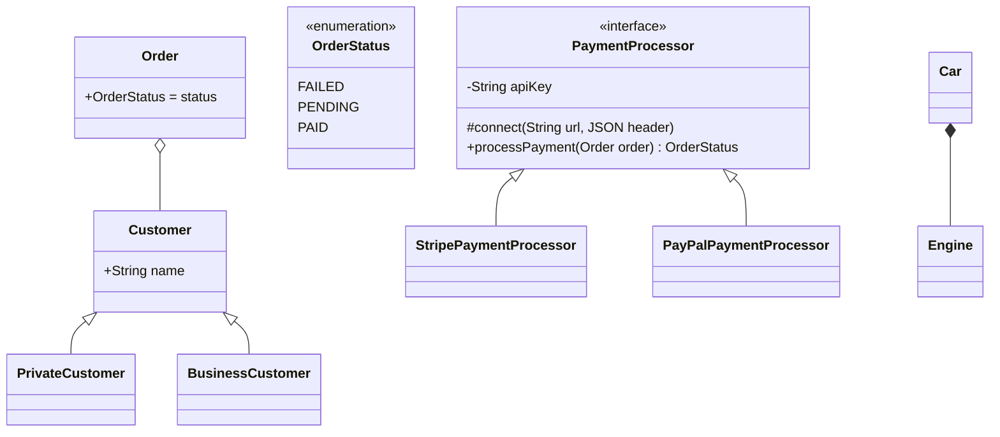
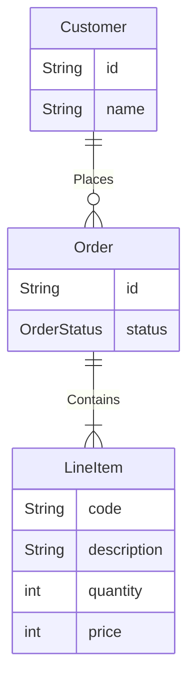

> Exercises for YouTube introductory video: "Mermaid JS: Finally There's A Great UML & Diagram Drawing Tool"; https://youtu.be/JiQmpA474BY

# Mermaid tutorial

## Flowchart Diagram Example

## Sequence Diagram Example

## Class Diagram Example

> '-' = private interface;
> '+' = public interface;
> '#' = protected interface;

> <|-- = inheritance relationship (e.g. class and a sub-class)

> o-- = aggregation relationship (another special case of an association relationship -> the object of the class relationship can exist independently of the associated class object) (e.g. Customer can be associated with an Order object, but if you delete the Order then you'd still want to keep the Customer object)

> *-- = composition relationship (a special case of an association relationship -> the object of the class relationship is composed of and doesn't exist independently of its associated class object) (e.g. A Student object can be connected to a Schedule object, but if you remove the Student object it would also make sense to remove the associated Schedule object for that student)

## Entity-Relationship Diagram Example

> A good diagram for entity domain modeling

> |o or o| = Zero or one
> || or || = Exactly one
> }o or o{ = Zero or more (no upper limit)
> }| or |{ = One or more (no upper limit)

