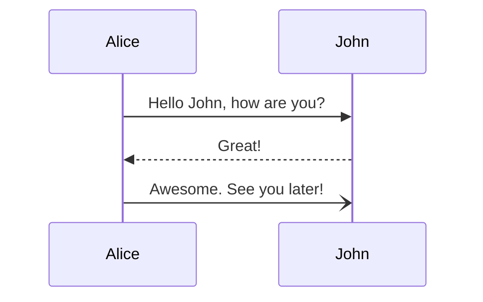
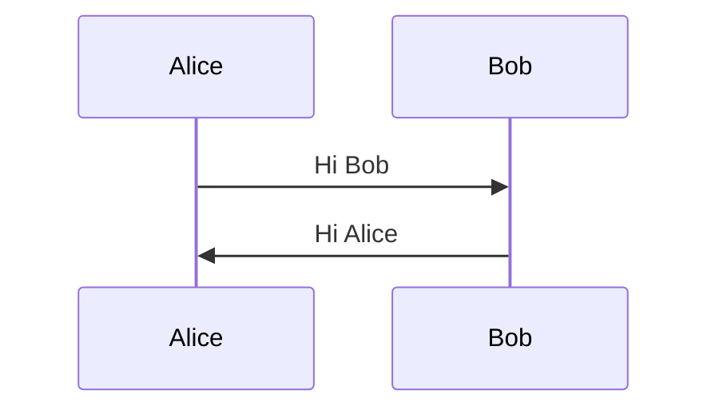
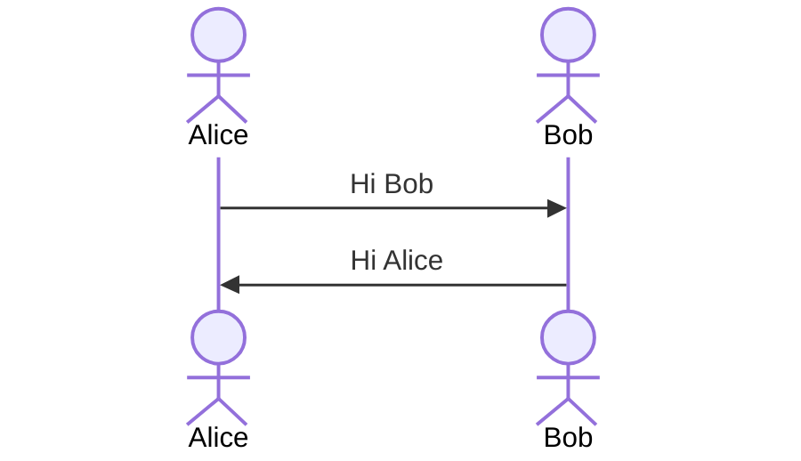
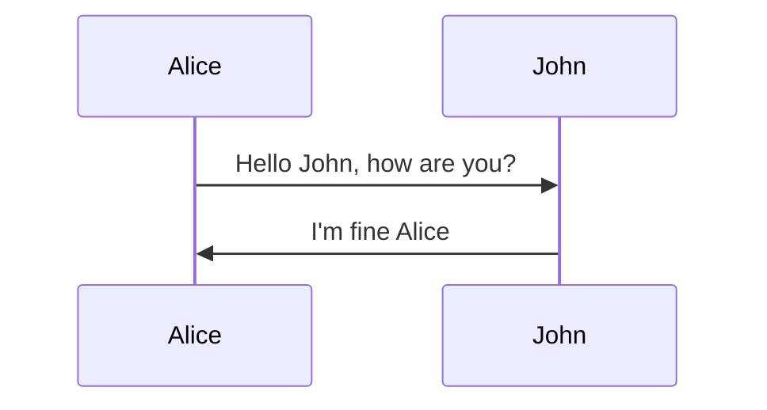

# Mermaid Sequence Diagram Examples

## Basic sequence diagram example

> **Note:** The word "end" could potentially break the diagram, due to the way that the mermaid language is scripted. If unavoidable, one must use parentheses(), quotation marks "", or brackets {},[], to enclose it.

## Syntax

### Participants

The participants can be defined implicitly as in the first example on this page. The participants or actors are rendered in order of appearance in the diagram source text. Sometimes you might want to show the participants in a different order than how they appear in the first message. It is possible to specify the actor's order of appearance by doing the following:

### Actors

If you specifically want to use the actor symbol instead of a rectangle with text you can do so by using actor statements as per below.

### Aliases

The actor can be assigned to a reference variable.

## Messages

Messages can be of two displayed either solid or with a dotted line.

> Pattern:
> [Actor][Arrow][Actor]:Message text

| Type | Description                                |
| ---- | ------------------------------------------ |
| ->   | Solid line without arrowhead               |
| -->  | Dotted line without arrowhead              |
| ->>  | Solid line with arrowhead                  |
| -->> | Dotted line with arrowhead                 |
| -x   | Solid line with a cross                    |
| --x  | Dotted line with a cross                   |
| -)   | Solid line with an open arrowhead (async)  |
| --)  | Dotted line with an open arrowhead (async) |

## Activations

ß