# Mermaid Sequence Diagram Examples

## Basic sequence diagram example


> **Note:** The word "end" could potentially break the diagram, due to the way that the mermaid language is scripted. If unavoidable, one must use parentheses(), quotation marks "", or brackets {},[], to enclose it.

-----

## Syntax

### Participants

The participants can be defined implicitly as in the first example on this page. The participants or actors are rendered in order of appearance in the diagram source text. Sometimes you might want to show the participants in a different order than how they appear in the first message. It is possible to specify the actor's order of appearance by doing the following:


### Actors

If you specifically want to use the actor symbol instead of a rectangle with text you can do so by using actor statements as per below.


### Aliases

The actor can be assigned to a reference variable.


-----

## Messages

Messages can be of two displayed either solid or with a dotted line.

Pattern:
`[Actor][Arrow][Actor]:Message text`

| Type | Description                                |
| ---- | ------------------------------------------ |
| ->   | Solid line without arrowhead               |
| -->  | Dotted line without arrowhead              |
| ->>  | Solid line with arrowhead                  |
| -->> | Dotted line with arrowhead                 |
| -x   | Solid line with a cross                    |
| --x  | Dotted line with a cross                   |
| -)   | Solid line with an open arrowhead (async)  |
| --)  | Dotted line with an open arrowhead (async) |

-----

## Activations

It is possible to activate and deactivate an actor. (de)activation can be dedicated declarations:

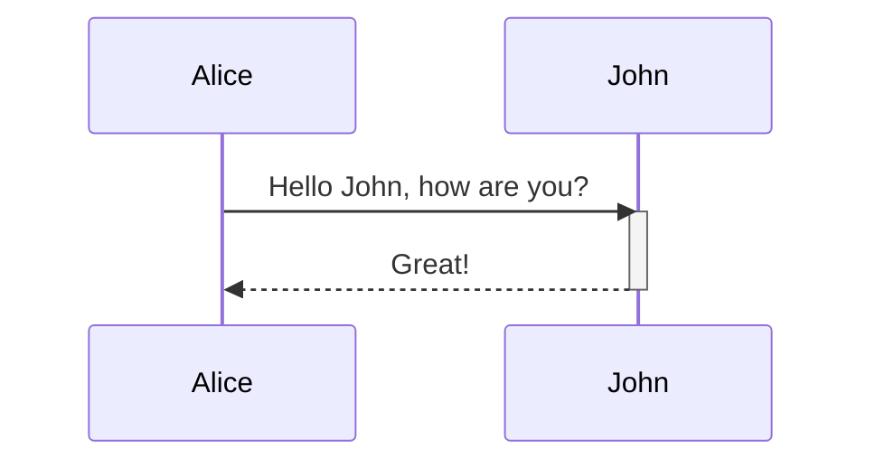

There is also a shortcut notation by appending +/- suffix to the message arrow:

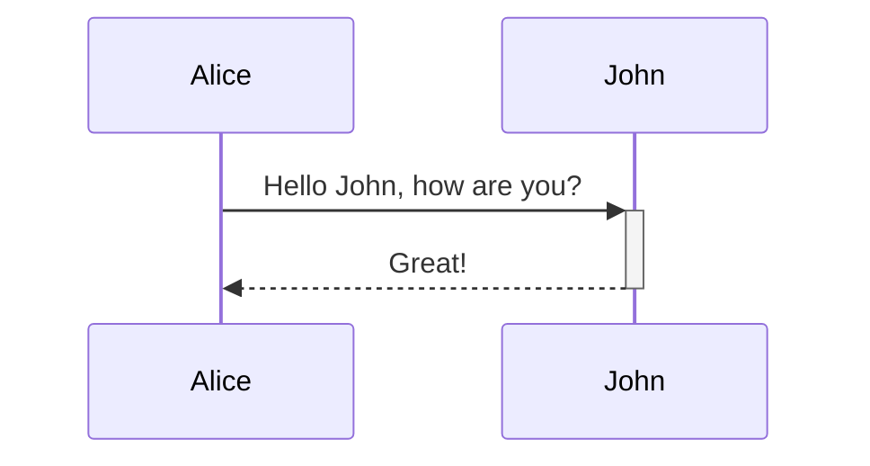

Activations can be stacked for same actor:

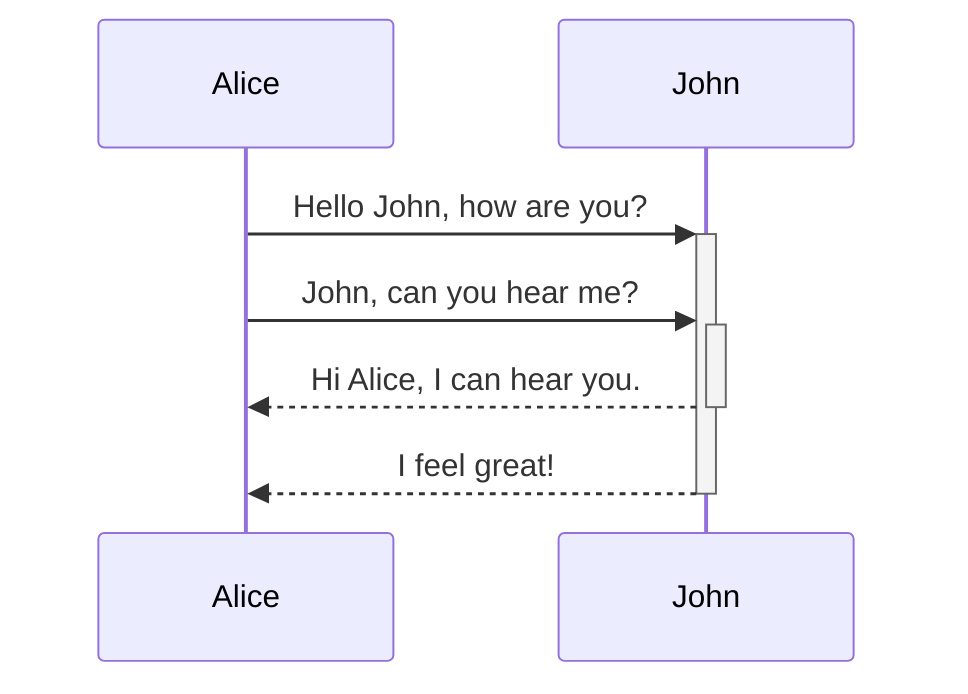

-----

## Notes

It is possible to add notes to a sequence diagram. This is done by the notation Note [ right of | left of | over ] [Actor]: Text in note content.

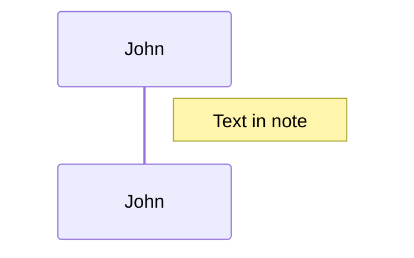

It is also possible to create notes spanning two participants:

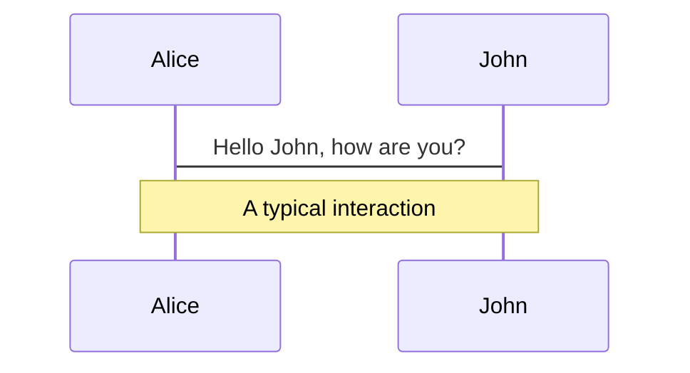

-----

## Loops

It is possible to express loops in a sequence diagram. This is done by the notation.

> loop Loop text
> ... statements ...
> end

Example:

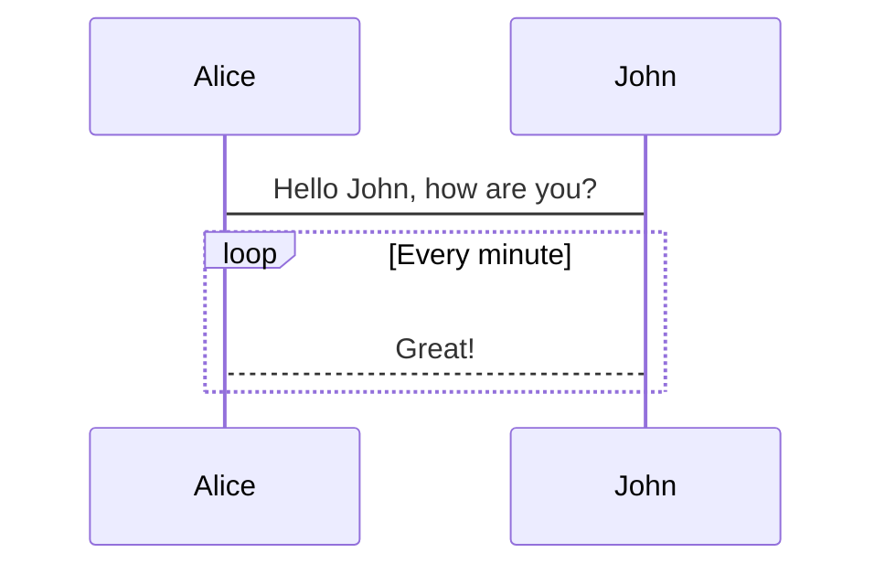

-----

## Alternative Paths

It is possible to express alternative paths in a sequence diagram. This is done by the notation.

> alt Describing text
> ... statements ...
> else
> ... statements ...
> end

or if there is sequence that is optional (if without else)...

> opt Describing text
> ... statements ...
> end

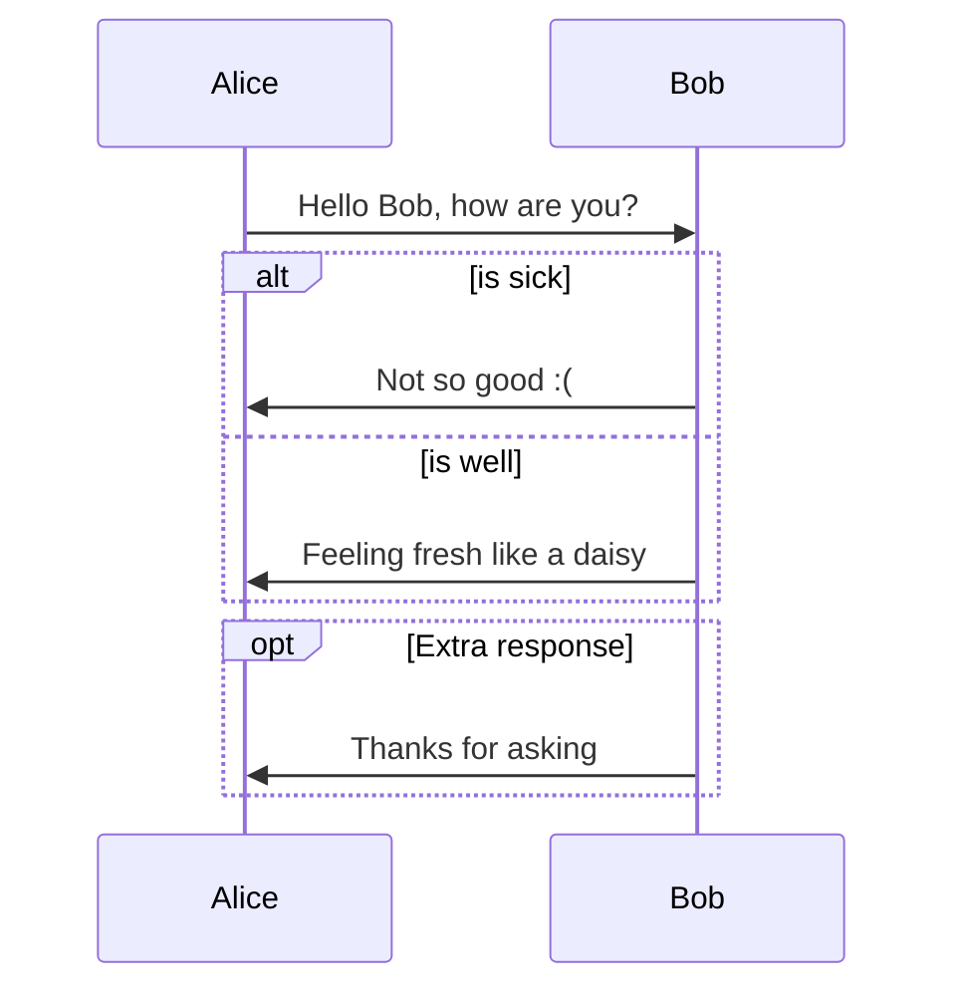

-----

## Parallels

It is possible to show actions that are happening in parallel. This is done by the notation.

> par [Action 1]
> ... statements ...
> and [Actions 2]
> ... statements ...
> and [Action N]
> ... statements ...
> end

Example:

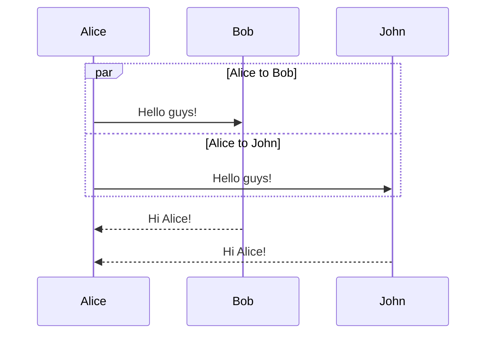

It is also possible to nest parallel blocks.

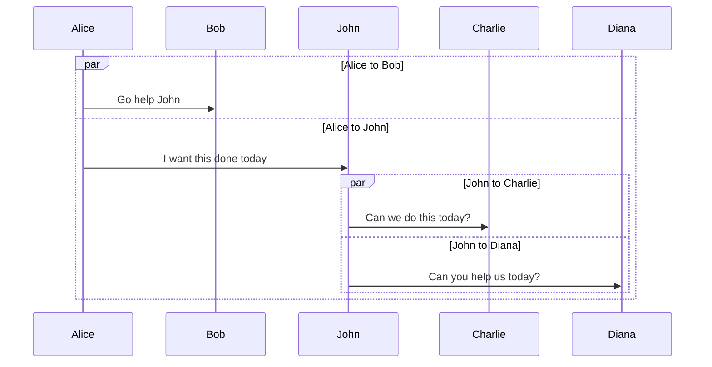

-----

## Critical Regions

It is possible to show actions that must happen automatically with conditional handling of circumstances. This is done by the notation.

> critical [Action that must be performed]
> ... statements ...
> options [Circumstance A]
> ... statements ...
> option [Circumstance B]
> ... statements ...
> end

Example:

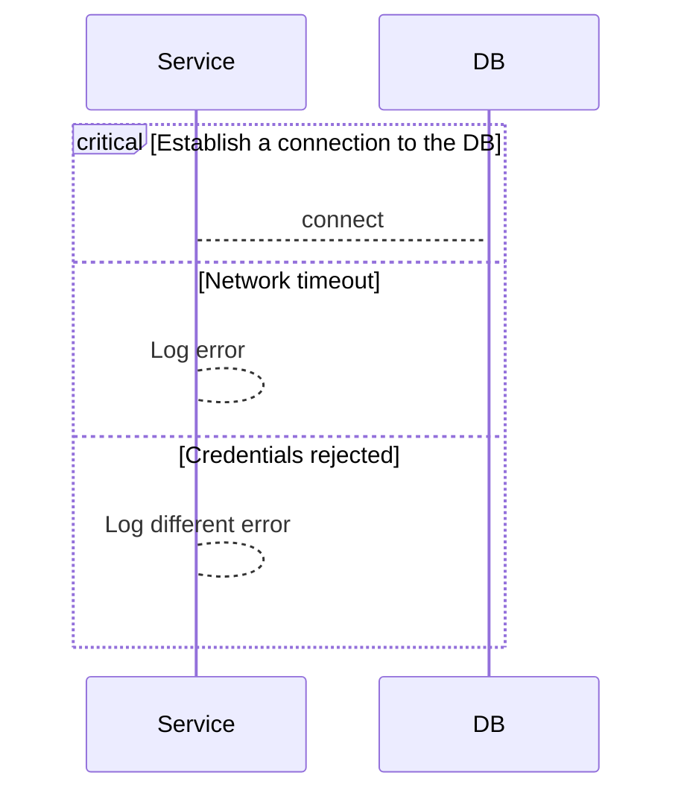

It is also possible to have no options at all...

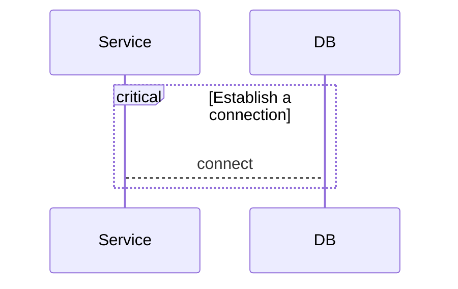

-----

## Breaks

It is possible to indicate a stop of the sequence within the flow (usually used to model exceptions).

> break
> ... statements ...
> end

Example below:

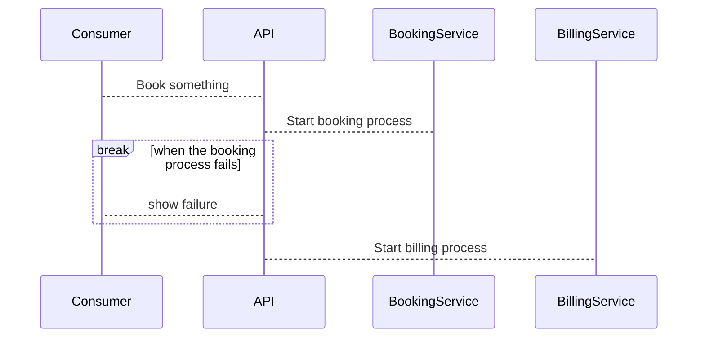

-----

## Background highlighting

It is possible to highlight flows by providing colored background rects. The colors are defined using rgb and rgba syntax. This is done by the notation:

> rect rgb(0, 255, 0)
> ... content ...
> end

Or...

> rect rgba(0, 0, 255, .1)
> ... content ...
> end

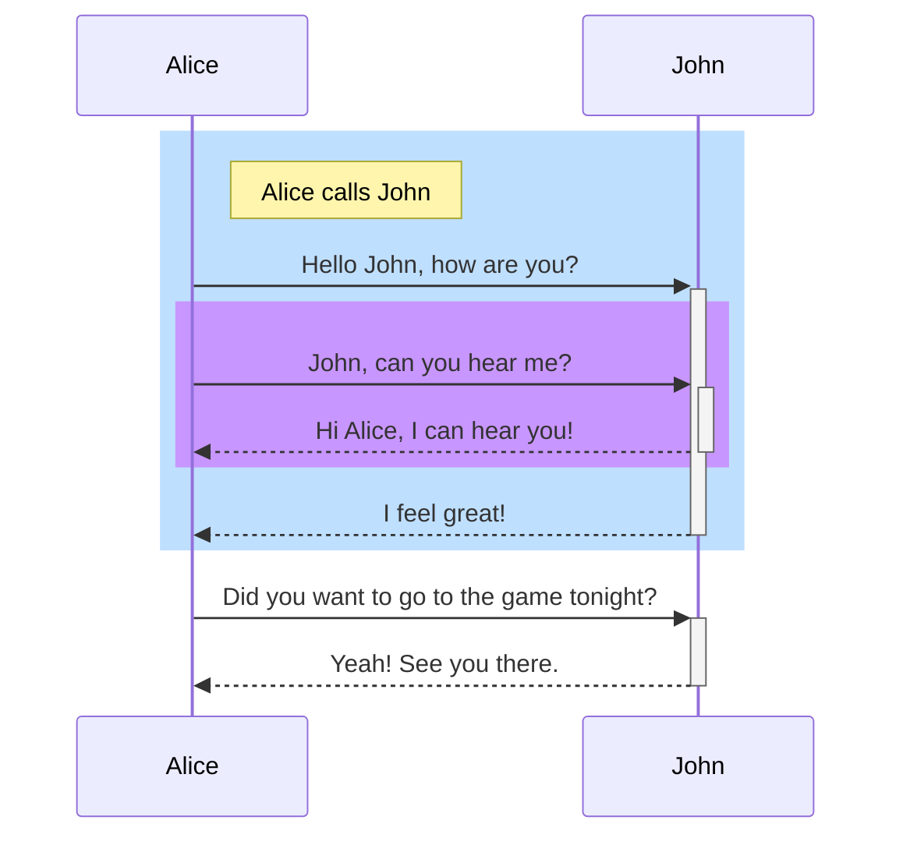

-----

## Comments

Comments can be entered within a sequence diagram, which will be ignored by the parser. Comments need to be on their own line, and must be prefaced with ```%%``` (double percent signs). Any text after the start of the comment to the next newline will be treated as a comment, including any diagram syntax.

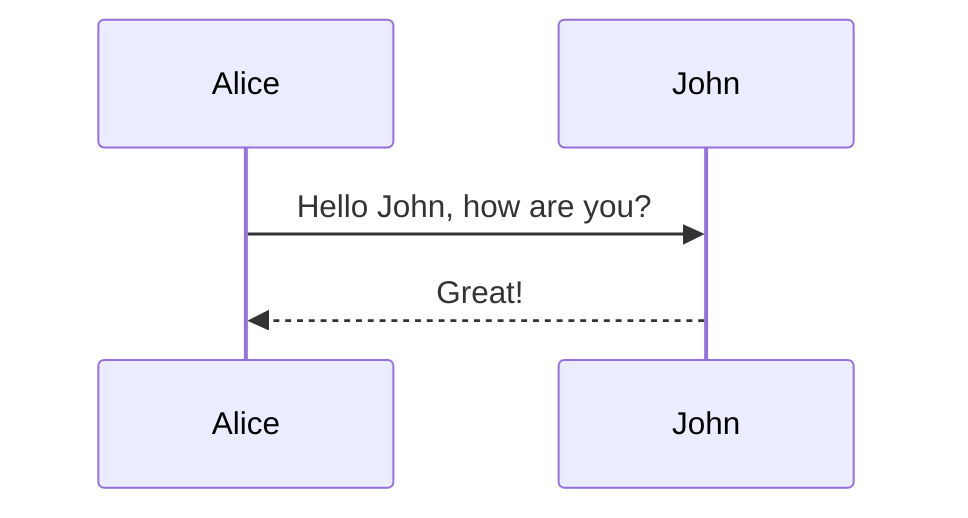

-----

## Entity codes to escape characters

It is possible to escape characters using the syntax exemplified here.

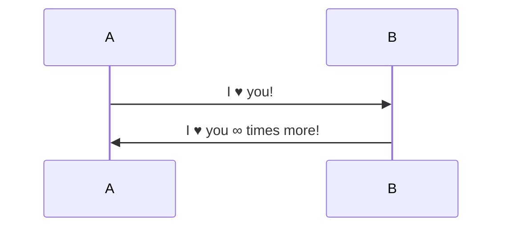

Numbers given are base 10, so ```#``` can be encoded as ```#35```;. It is also supported to use HTML character names.

Because semicolons can be used instead of line breaks to define the markup, you need to use ```#59``` to include a semicolon in message text.

-----

## Sequence Numbers

It is possible to get a sequence number attached to each arrow in a sequence diagram. This can be configured when adding mermaid to the website as shown below:

```markdown
<script>
  mermaid.initialize({ sequence: { showSequenceNumbers: true }, });
</script>
```

It can also be be turned on via the diagram using "autonumber":

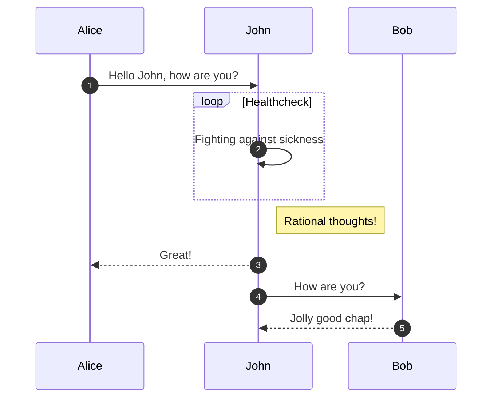

-----

## Actor menus

Actors can have popup-menus containing individualized links to external pages. For example, if an actor represented a web service, useful links might include a link to the service health dashboard, repo containing the code for the service, or a wiki page describing the service.

This can be configured by adding one or more link lines with the format:

```markdown
  link <actor>: <link-label> @ <link-url>
```

Example:

```mermaid
  sequenceDiagram
    participant Alice
    participant John

    link Alice: Dashboard @ https://dashboard.contoso.com/alice
    link Alice: Wiki @ https://wiki.contoso.com/alice
    link John: Dashboard @ https://dashboard.contoso.com/john
    link John: Wiki @ https://wiki.contoso.com/john

    Alice ->> John: Hello John, how are you?
    John ->> Alice: Great!
    Alice -) John: See you later!
```

### Advanced menu syntax

There is an advanced syntax that relies on JSON formatting. This can be configured by adding the links lines with the format:

```markdown
  links <actor>: <json-formatted link-name link-url pairs>
```

Example:

```mermaid
  sequenceDiagram
    participant Alice
    participant John
    
    links Alice: {"Dashboard": "https://dashboard.contoso.com/alice", "Wiki": "https://wiki.contoso.com/alice"}
    links John: {"Dashboard": "https://dashboard.contoso.com/john", "Wiki": "https://wiki.contoso.com/john"}

    Alice ->> John: Hi John, how are you?
    John -->> Alice: Great!
    Alice -) John: See you later!
```

-----
