# Mermaid State Diagram Examples

## State diagram overview

> "A state diagram is a type of diagram used in computer science and related fields to describe the behavior of systems. State diagrams require that the system described is composed of a finite number of states; sometimes, this is indeed the case, while at other times this is a reasonable abstraction." - Wikipedia

Mermaid can render state diagrams. The syntax tries to be compliant with the syntax used in plantUml as this will make it easier for users to share diagrams between mermaid and plantUml.

In state diagrams systems are described in terms of its states and how the systems state can change to another state via a transitions. The example diagrams below shows three states Still, Moving and Crash. You start in the state of Still. From Still you can change the state to Moving. In Moving you can change the state either back to Still or to Crash. There is no transition from Still to Crash.

Version 2 renderer example:

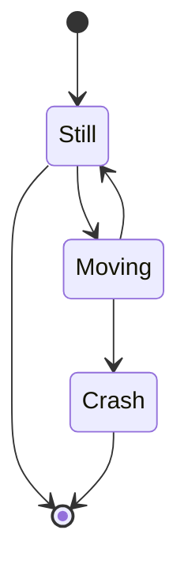

Older version renderer example:

-----

## States

A state can be declared in multiple ways. The simplest way is to define a state id as a description.

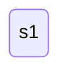

Another way is by using the state keyword with a description as per below:

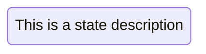

Another way to define a state with a description is to define the state id followed by a colon and the description:

### Spaces in state names

Spaces can be added to a state by defining it at the top and referencing the acronym later.

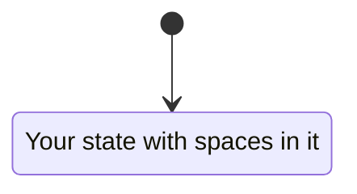

-----

## Transitions

Transitions are path/edges when one state passes into another. This is represented using text arrow, "-->".

When you define a transition between two states and the states are not already defined the undefined states are defined with the id from the transition. You can later add descriptions to states defined this way.

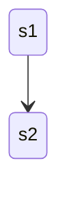

It is possible to add text to a transition. To describe what it represents.

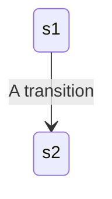

-----

## Start and end

There are two special states indicating the start and stop of the diagram. These are written with the [*] syntax and the direction of the transition to it defines it either as a start or a stop state.

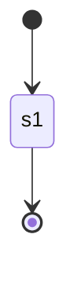

-----

## Composite states

In a real world use of state diagrams you often end up with diagrams that are multi-dimensional as one state can have several internal states. These are called composite states in this terminology.

In order to define a composite state you need to use the state keyword followed by an id and the body of the composite state between {}. See the example below:

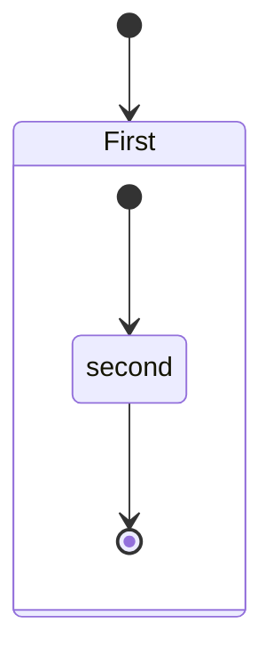

You can even do this in several layers:

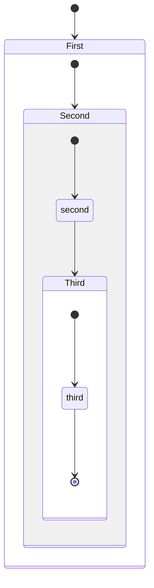

You can also define transitions also between composite states:

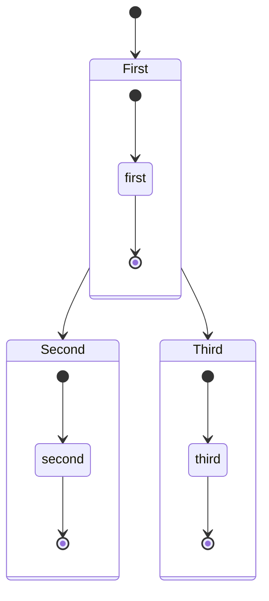

***Note.*** *You cannot define transitions between internal states belonging to different composite states.*

-----

## Choice

Sometimes you need to model a choice between two or more paths, you can do so using \<\<choice>>. Example:

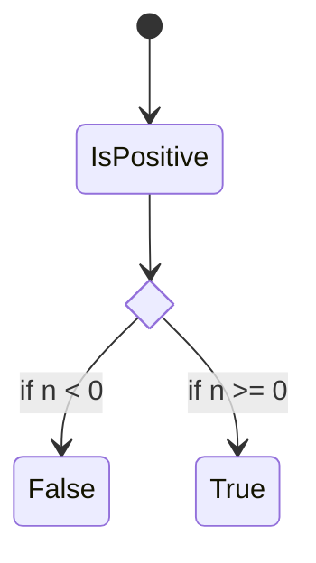

-----

## Forks

It is possible to specify a fork in the diagram using \<\<fork>> \<\<join>>. Example:

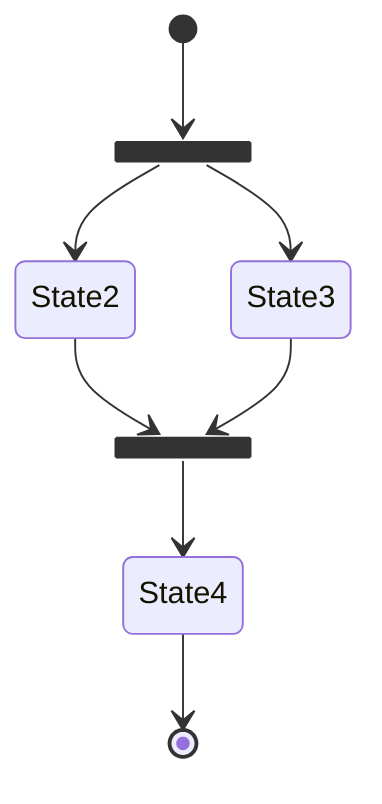

-----

## Notes

You can choose to put a note to the right of or to the left of a node. Example:

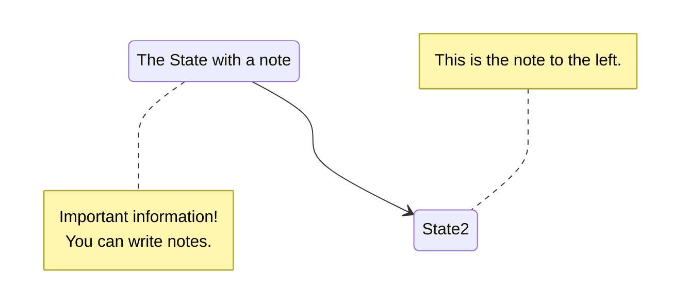

-----

## Concurrency

As in plantUml you can specify concurrency using the -- symbol.

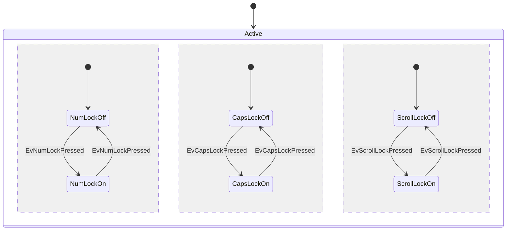

-----

## Setting the direction of the diagram

With state diagrams you can use the direction statement to set the direction which the diagram will render like in this example.

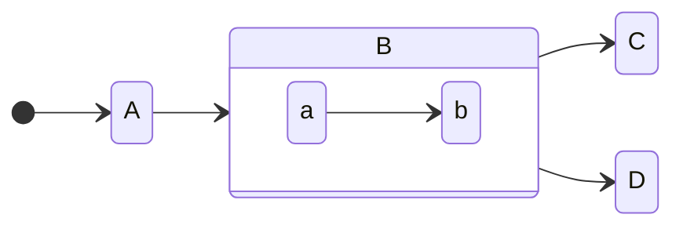

-----

## Comments

Comments can be entered within a state diagram chart, which will be ignored by the parser. Comments need to be on their own line, and must be prefaced with `%%` (double percent signs). Any text after the start of the comment to the next newline will be treated as a comment, including any diagram syntax. Example:

